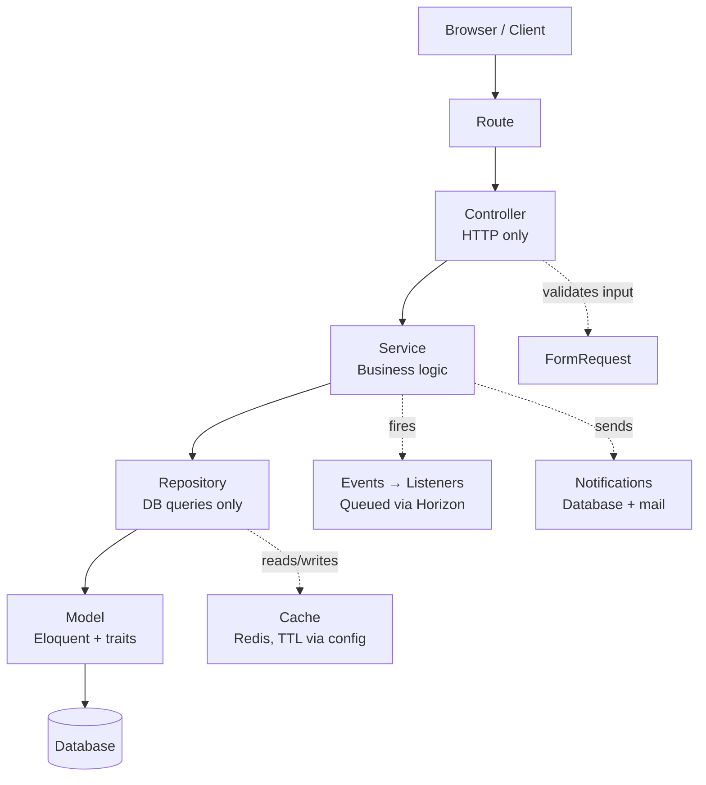
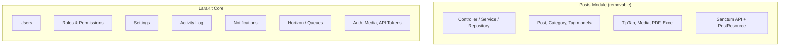

# LaraKit

A production-ready Laravel admin panel starter template built with React, Inertia.js and TypeScript. Clone it, understand every line, extend it however you need.

---

## Why LaraKit?

Every Laravel project eventually needs an admin panel. The usual options:

|               | Filament    | Nova      | LaraKit         |
| ------------- | ----------- | --------- | --------------- |
| Frontend      | Livewire    | Blade/Vue | React + Inertia |
| Customization | Opinionated | Limited   | Fully yours     |
| Source        | Open        | Closed    | Open            |

LaraKit is built to be read and understood, not just used. Every architectural decision has a reason behind it.

---

## Tech Stack

| Layer       | Technology                |
| ----------- | ------------------------- |
| Backend     | Laravel 12, PHP 8.4       |
| Frontend    | React 19, TypeScript      |
| Bridge      | Inertia.js                |
| Styling     | Tailwind CSS, shadcn/ui   |
| Auth        | Laravel Fortify, Sanctum  |
| Permissions | Spatie Laravel Permission |
| Media       | Spatie Media Library      |
| Activity    | Spatie Activity Log       |
| Queue       | Redis + Laravel Horizon   |
| Icons       | Lucide React              |
| Testing     | Pest                      |

---

## Architecture

LaraKit enforces a strict layered architecture. Every layer has exactly one responsibility.





Controllers stay thin. Business rules live in one place. Any module can be removed without touching the core.

---

## Features

### Authentication & Authorization

- Laravel Fortify - login, logout, 2FA ready
- Role-based access control via Spatie Permission
- Four roles: `super_admin`, `admin`, `editor`, `viewer`
- `EnsureUserIsAdmin` middleware on all admin routes
- Fine-grained protection rules - super admin cannot be edited by others, admins cannot edit peers, nobody can change their own role or deactivate themselves
- Role-based sidebar visibility - editors see Posts and Dashboard only, admins see everything except System Health

### Roles & Permissions UI Manager

- Manage roles directly from the panel
- Assign and revoke permissions per role
- Changes take effect immediately without re-seeding

### Users Module

- Full CRUD with pagination
- Search by name or email, debounced
- Filter by role and status
- Soft delete with trash, restore, and force delete
- Avatar upload via Spatie Media Library
- Role assignment with permission-based restrictions
- Activity logging on all mutations

### Dashboard

- Stats cards: Total Users, Active, Inactive, Trashed, Activity count
- Every card links to the relevant filtered page

### Site Settings

- Key-value store with default settings across four groups: General, Social, SEO, Mail
- Dynamic input types: text, email, url, textarea, file, boolean, color
- Logo, favicon, and OG image via Media Library
- Cache-driven with a 1-hour TTL, invalidated on every change

### Activity Log

- Full audit trail showing who did what, to which model, with old and new values
- Filter by event type and model
- Pagination with filter preservation
- Relative timestamps

### Events, Listeners & Queues

- `UserCreated` event fired on every new user creation
- `SendWelcomeEmail` listener - queued, sends a welcome mailable to the new user
- `NotifyAdminsOfNewUser` listener - queued, notifies all admins via database and email
- Redis-backed queue for all async work
- Laravel Horizon - real-time queue monitoring dashboard

### Notifications

- Bell icon in the sidebar with unread count badge
- Dropdown showing recent notifications
- Mark as read, mark all as read
- Clicking a notification navigates directly to the relevant resource
- Database and email channels, fully queued

### Login History

- Last login timestamp, IP address, and user agent tracked per user
- Displayed on the user edit page

### Code Quality

- Laravel Pint - `strict_types=1` enforced across all PHP files
- Docblocks on every class and public method
- N+1 protection - `preventLazyLoading()` in development, DB indexes on performance-critical columns
- Telescope - query, request, mail, and job inspection at `/telescope`

### Security

- Login rate limiting - 5 attempts per 60 seconds per IP, configured via `config/larakit.php`
- API rate limiting - 60 requests per 60 seconds, per user ID when authenticated, per IP when guest
- Security headers on every response - `X-Frame-Options`, `X-Content-Type-Options`, `Referrer-Policy`, `Permissions-Policy`
- SQL injection protection via Eloquent PDO prepared statements
- CSRF protection via Laravel's built-in token middleware
- XSS protection via Blade's `{{ }}` output escaping
- Sentry error tracking - production only, silent in local and staging

### System Health & Maintenance Panel

- Horizon queue status - running, paused, or inactive
- Redis memory usage
- Failed job count with color indicator
- Clear config, route, and view cache from the browser
- Maintenance mode toggle with a secret bypass URL
- PHP and Laravel version display
- Accessible to `super_admin` only

### UI / UX

- Dark and light mode
- Fully responsive - horizontal scroll on tables for mobile
- Flash messages with timestamp-based re-triggering
- Confirmation dialogs on all destructive actions

### Posts Module

- Full CRUD with categories (many-to-one) and tags (many-to-many)
- TipTap rich text editor - bold, italic, headings, lists, links, alignment
- Featured image upload via Spatie Media Library
- SEO fields - meta title and meta description
- Status management - draft, published, scheduled with publish date
- Author assignment
- Soft delete with trash, restore, and force delete
- Activity logging on all mutations
- PDF export via DomPDF - streams a styled PDF from the posts index
- Excel export via Laravel Excel - downloads all posts as a formatted `.xlsx` file
- Fully separated - removable without touching LaraKit core

### API Layer

- Versioned REST API at `/api/v1/`
- Health check at `/api/v1/health`
- Posts endpoints - paginated list and single post by slug
- API Resources - clean JSON output, no raw database fields exposed
- Sanctum token authentication - Bearer token in the Authorization header
- Token management UI - create, list, and revoke tokens from the admin panel
- Postman collection - importable JSON at `postman/larakit.postman_collection.json`

### Multilingual UI

- Language switcher (EN / KA) in the sidebar
- Cookie-based locale persistence
- Translation files via Laravel lang files
- `useTranslations` hook for React components

### Test Suite

- 39 tests, 111 assertions
- Auth tests - guest redirect, role protection
- User tests - full CRUD and all protection rules
- Settings tests - view, update, redirect, cache invalidation
- Notification tests - welcome email and admin notification fakes
- API tests - Sanctum auth, posts list, single post, health check
- Factories for User, Post, Category, and Tag

### Deployment

- Docker - `docker-compose.yml` with app, MySQL, Redis, and Horizon
- GitHub Actions CI/CD - Pint check and Pest suite on every push
- Deployment guides - VPS guide, production checklist, fully documented `.env.example`
- Setup script - `scripts/setup.sh` for a one-command fresh install

---

## Developer Notes

### Regenerating Wayfinder

LaraKit uses Wayfinder for typed route helpers. Due to a breaking change in v0.1.7, `form` helpers are no longer generated automatically.

Always use the provided script instead of running `php artisan wayfinder:generate` directly:

```bash
bash scripts/wayfinder.sh
```

This regenerates all route types and restores the form helpers needed by auth and settings pages.

---

## Known Limitations

- No multi-tenancy support - see `larakit-saas` (planned)
- No page builder - see `larakit-cms` (planned)
